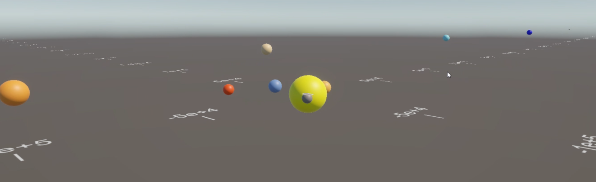

# Solar System Simulator (N-Body Gravity)

A lightweight and extensible planetary simulation built in Unity 6000.0.371 LTS



## Features

- **Accurate N-body physics** via **leapfrog integration** ([why leapfrog?](#physics-implementation))
- **Dynamic visual scaling** ensures visibility of all celestial bodies at all zoom levels ([scaling rationale](#visual-scaling-system))
- **Camera controls**:
  - Orbital rotation with pitch locking
  - Smooth panning
- **Adaptive grid** with scientific notation labels
- **Timelapse**: Simulate anywhere from 100 seconds to 1e8 seconds per real-time second

---

## Setup Guide

### Installation
1. Clone this repository.
2. **Import into Unity**:
   - Copy the following folders into your Unity project:
     - `/Assets`
     - `/ProjectSettings`

The main simulation scene is located at:  
`Assets/Scenes/SimulatorScene.unity`

All simulation logic resides in:  
`Assets/Project/Scripts/`

---

### Adding Planets

Add planets via code in `Simulator.cs`:

```csharp
void Start() {
    // Syntax: AddPlanet(name, position, velocity, mass, radius, color)
    AddPlanet(
        "Earth", 
        new Vector3(23454f, 0, 0),         // Position in Earth radii
        new Vector3(0, 0, 0.00471f),       // Velocity in Earth radii/sec
        1f,                                // Mass in Earth masses
        1f,                                // Radius in Earth radii
        new Color(0.2f, 0.4f, 0.8f)        // Color
    );
}
```

> *Note*: The simulation runs strictly on the **X-Z plane**. Always keep `position.y` and `velocity.y` at 0 (That being said, the code can be easily extended to work for 3D).

---

## Controls

| Action | Input |
|--------|-------|
| Orbit camera | Right-click + drag |
| Pan camera | Left-click + drag |
| Zoom | Mouse wheel |

---

## Units & Conversions

| Parameter | Unit | Conversion |
|----------|------|------------|
| **Position** | Earth radii | `1 unit = 6,371 km` |
| **Velocity** | Earth radii/sec | `1 unit = 6,371 km/s` |
| **Mass** | Earth masses | `1 unit = 5.97×10²⁴ kg` |

---

## Physics Implementation

The simulation uses **Leapfrog integration**, a symplectic method that:
- Preserves energy over time
- Avoids numerical instability common in Euler integration
- Efficiently handles gravitational acceleration for multiple bodies ($O(n^2)$)

```math
x_{n+1} = x_n + v_nΔt + \frac{1}{2}a_nΔt^2 \\
v_{n+1} = v_n + \frac{1}{2}(a_n + a_{n+1})Δt
```

Learn more:  
- [Leapfrog Integration – Wikipedia](https://en.wikipedia.org/wiki/Leapfrog_integration)  
- [N-body Problem – NASA](https://science.nasa.gov/astrophysics/focus-areas/n-body-problem)

---

### Orbital Accuracy Test

To validate the accuracy of the simulation's gravitational model and numerical integrator (leapfrog), each planet in the solar system (including Pluto) was simulated for **30 orbits** under default conditions. The real-life orbital periods were compared against their simulated averages. The timescale was set to 1e7 (i.e in every second in real-life, 1e7 seconds passes in the simulator).

**Note**: All times are in **seconds**.

| Planet  | Real Orbital Period | Simulated Orbital Period (avg over 30 orbits) | Error Margin |
|---------|---------------------|-----------------------------------------------|--------------|
| Mercury | 7.60×10⁶            | 7.36×10⁶                                      | 3.19%        |
| Venus   | 1.94×10⁷            | 1.94×10⁷                                      | 0.38%        |
| Earth   | 3.15×10⁷            | 3.23×10⁷                                      | 2.52%        |
| Mars    | 5.94×10⁷            | 5.86×10⁷                                      | 1.22%        |
| Jupiter | 3.74×10⁸            | 3.69×10⁸                                      | 1.55%        |
| Saturn  | 9.30×10⁸            | 9.34×10⁸                                      | 0.45%        |
| Uranus  | 2.65×10⁹            | 2.64×10⁹                                      | 0.29%        |
| Neptune | 5.20×10⁹            | 5.09×10⁹                                      | 2.16%        |
| Pluto   | 7.82×10⁹            | 7.60×10⁹                                      | 2.86%        |

*Reference: [NASA Space Place](https://spaceplace.nasa.gov/years-on-other-planets/en/)*

---

## Visual Scaling System

### Rationale

In planetary simulations, planets are **millions of times smaller** than their orbital distances. This creates visual problems:
- Small planets disappear at distant zoom levels
- Larger planets dominate the view unrealistically when zoomed in

To address this, the simulation uses a modified visual scaling system based on camera distance:

### Base Scaling Function – `f(d)`

Defines the visible size of a **reference planet** (0.1 Earth radii) based on the camera’s current distance `d`:

```csharp
float f(float d) {
    return Mathf.Lerp(1e3f, 1e5f, 
        (d - Constraints.MIN_CAMERA_DISTANCE) /
        (Constraints.MAX_CAMERA_DISTANCE - Constraints.MIN_CAMERA_DISTANCE));
}
```

- Maps distance \([100, 1e7]\) to scale factor \([1e3, 1e5]\)
- Ensures that even the smallest bodies remain visible at all zoom levels

### Relative Scaling Function – `g(d, logr)`

Adjusts each planet’s radius **proportionally** to its logarithmic size relative to the rest of the system:

```csharp
float g(float d, float logr) {
    float x = Mathf.Lerp(Constraints.MIN_RADIUS_RATIO, Constraints.MAX_RADIUS_RATIO, 
        (d - Constraints.MIN_CAMERA_DISTANCE) /
        (Constraints.MAX_CAMERA_DISTANCE - Constraints.MIN_CAMERA_DISTANCE));

    float val = Mathf.Lerp(1f, x, 
        (logr - relativeMinRadiusLog) / 
        (relativeMaxRadusLog - relativeMinRadiusLog));
    
    return val;
}
```

- `logr` is the base-10 log of the planet's physical radius
- `relativeMinRadiusLog` and `relativeMaxRadusLog` represent the smallest/largest values in the system
- Helps maintain consistent **relative visibility** between large and small planets

---

## Constraints

Recommended to avoid simulation instability or overflow:

| Parameter | Range |
|----------|--------|
| Mass | \(10^{-10}\) to \(10^{15}\) Earth masses |
| Radius | 0.1 to 100 Earth radii |
| Timelapse | 100 to 1e8 sec/sec |
| Camera distance | 100 to 1e7 Earth radii |

---

## Suggested Improvements

### Priority Features

| Feature | Benefit |
|--------|---------|
| **UI-based planet editor** | Add bodies interactively, no coding required |
| **Trail renderer** | Visually track orbital paths |
| **Save/load system** | Reuse and share simulations |
| **Collision detection** | Handle planetary interactions (e.g. merging, bouncing)

---

### Advanced Optimizations

- **Barnes-Hut Octree**: Reduces N-body complexity from O(n²) to O(n log n)
- **GPU Compute Shaders**: Enable real-time simulation of thousands of bodies
- **Level of Detail (LOD)**: Improve performance with scalable mesh/texture quality
